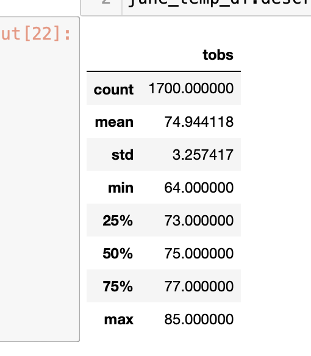

# surfs_up
Overview of the analysis: Explain the purpose of this analysis.
Results: Provide a bulleted list with three major points from the two analysis deliverables. Use images as support where needed.
Summary: Provide a high-level summary of the results and two additional queries that you would perform to gather more weather data for June and December.

### Overview

In this analysis I used different programs to check my data. I used python and SQLAlchemny to query through a SQLite file that contained weather data for hawaii. The goal was to go through this data and see where we should place our surfing buisness and if it was going to profitable. The first part of this project was to find the temperatures in june and the second part was to see temperatures in december. Using this data we ran various analysis methods to get the data we needed.

### Results

As for our results we got the following for June:

As for our results in December we got:

- an important takeaway from this data would be that our temperatures do not change much in these months and would allow for us to have steady buisness as people will be able to surf.

- near the end of december I would advise to close shop for some time because it does get colder and we would have significantly less amount of surfers during this time.

- with the consistincy of the weather in hawaii we should be able to keep shop open for long periods of time. This data allowed us to see what times to keep our shop open and what times to keep it closed. This data also allows us to see and predict what times of the month we would have the most customers.

### Summary

- when looking at this data as said previously not much changes temperature wise. However, we can look at the history of hawaii's weather in december and we see that it rains pretty often. We can also see that there are wet seasons so our buisness will be slow in december. Also during holidays in christmas we would assume that less people will come so we should close shop around those times.
